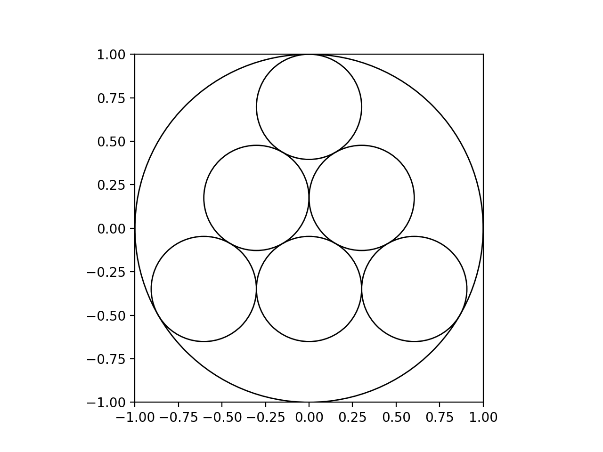

<h1 align="center">Temple Geometry</h1>

A simple python program to draw temple geometry with configurable parameters for:
- number of layers
- radius of the big circle
- x and y axis of the big circle
